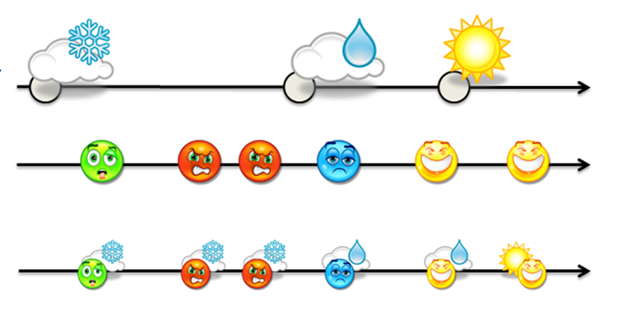

```{r setup, include=FALSE}
library(ROAuth)
library(plyr)

library(stringr)
library(ggplot2)

library(flexdashboard)


```

### CAN WEATHER AFFECT YOUR MOOD. Final Project DATA607.               


___Final Project DATA607.___


___Lidiia Tronina___


___December, 10 2017___


####How weather influences the way we communicate on Twitter





### Introduction

####How weather influences the way we communicate on Twitter


Weather has long been regarded to impact everyday behavior. Spending time outdoors when it’s sunny is linked with a mood boost, that are casually referred to as “nice days”, whereas moods are lowered by cold and cloudy days, conditions that are generically classified as a “poor weather day”.  However, studies on the relationship between weather and mood are limited, difficult to interpret, and have mixed result.  

My project will be based on analysis of people’s mood variations on Twitter. Twitter can be an amazing open sourse for text and social web analyses. 
I’ll design R code for analyzing Twitter posts content via calculating the number of positive, negative and neutral words. My research will take place in New York City and compare “nice day” tweets to “poor weather day” tweets. 


### Get The Data


Data collection:

- Get access to Twitter API

- Create code to retrive tweets for each day in New York City

- Create data_frame containing 3000 unique tweets for each date starting 12/03/17 to 12/09/17 at assigned coordinates

- Get past 7 days forecast


```{r, eval=F, echo=T}
december8_search<- searchTwitter("#newyork -filter:retweets",n=3000, since = "2017-12-08", until = "2017-12-09", geocode = "40.7128,-74.0060, 50mi")
```


There are certain limitations doing Twitter Analysis using R:

- Twitter API can only return past 7-10 days data

- Not every tweet has location assigned to it, so I had to add "#newyork"" as search keyword.

### Sentiment analysis

- Download list of negative and positive words. 
Availible here: https://github.com/jeffreybreen/twitter-sentiment-analysis-tutorial-201107/tree/master/data/opinion-lexicon-English

- Evaluate each tweet based on list of positive and negative words

- Create a table with count of negative and positive words per day

```{r}
sent <- read.table("https://raw.githubusercontent.com/Lidiia25/DATA607_final_project/master/df_dec9.csv", header = T, sep = ",")
DT::datatable(sent, rownames = FALSE, options = list(
  pageLength = 50
))
```


### Coding

```{r, eval=F, echo=T}
pos.words <- scan('https://raw.githubusercontent.com/Lidiia25/DATA607_final_project/master/positive-words.txt', what='character', comment.char=';') 
 neg.words <-  scan('https://raw.githubusercontent.com/Lidiia25/DATA607_final_project/master/negative-words.txt', what='character', comment.char=';') 
 score.sentiment <- function(sentences, pos.words, neg.words, .progress='none')
 {
 require(plyr)
 require(stringr)
 scores <- laply(sentences, function(sentence, pos.words, neg.words){
 sentence <- gsub('[[:punct:]]', "", sentence)
 sentence <- gsub('[[:cntrl:]]', "", sentence)
 sentence <- gsub('\\d+', "", sentence)
 sentence <- tolower(sentence)
 word.list <- str_split(sentence, '\\s+')
 words <- unlist(word.list)
 pos.matches <- match(words, pos.words)
 neg.matches <- match(words, neg.words)
 pos.matches <- !is.na(pos.matches)
 neg.matches <- !is.na(neg.matches)
 score <- sum(pos.matches) - sum(neg.matches)
 return(score)
 }, pos.words, neg.words, .progress=.progress)
 scores.df <- data.frame(score=scores, text=sentences)
 return(scores.df)
 }
 december$text <- as.factor(december$text)
december$text <- sapply(december$text,function(row) iconv(row, "latin1", "ASCII", sub=""))
december_sentiment <- score.sentiment(december$text, pos.words, neg.words, .progress='text')
december2 <- december_sentiment
december2$created <- december$created
december2$created <- as.Date(december2$created)
december3 <- mutate(december2, tweet=ifelse(december2$score > 0, 'positive', ifelse(december2$score < 0, 'negative', 'neutral')))
 december4 <- group_by(december3, tweet, created)
december4 <- summarise(december4, number=n())
dec_final <- subset(december4, tweet != "neutral")

```


### Results
```{r}
dec_final1 <- read.table("https://raw.githubusercontent.com/Lidiia25/DATA607_final_project/master/dec_final.csv", header = T, sep = ",")
DT::datatable(dec_final1, rownames = FALSE, options = list(
  pageLength = 50
))
```


### Visualizing
```{r}

dec_final1$created <- as.Date(dec_final1$created)
ggplot(dec_final1, aes(created, number)) + geom_line(aes(group=tweet, color=tweet), size=2) +
 geom_point(aes(group=tweet, color=tweet), size=3) +
 theme(text = element_text(size=10), axis.text.x = element_text(angle=45, vjust=1)) + ggtitle(dec_final1) + scale_x_date(name = 'date', date_breaks = '1 day', date_labels = '%D') +
 annotate("text", x = as.Date("2017-12-09"), y = 700 , label = "Snow") +
 annotate("text", x = as.Date("2017-12-03"), y = 700 , label = "Cloudy") +
 annotate("text", x = as.Date("2017-12-05"), y = 700 , label = "Rain") +
 annotate("text", x = as.Date("2017-12-09"), y = 600 , label = "33°F") +
 annotate("text", x = as.Date("2017-12-03"), y = 600 , label = "45°F") +
 annotate("text", x = as.Date("2017-12-05"), y = 600 , label = "56°F") +
 annotate("text", x = as.Date("2017-12-04"), y = 600 , label = "46°F") +
 annotate("text", x = as.Date("2017-12-06"), y = 600 , label = "50°F") +
 annotate("text", x = as.Date("2017-12-07"), y = 600 , label = "41°F") +
 annotate("text", x = as.Date("2017-12-08"), y = 600 , label = "37°F")  + ylim(150, 1200)
```


*** 
12/03/17  Cloudy and cold weather. There are increased number of negative tweets. 

12/09/17 First snow day in NYC. There are increase number of positive tweets


### Conclusion

My research shows that weather affects the way people express themselves on social media. People tend to tweet positive messages on "nice days" more and negative messages when it's clody and rainy weather.

Twitter is an amazing tool that can track attitudes and feelings on the web on variety of subjects.  

Twitter sentiment analysis tools enable businesses to:

- See what people are saying about the business’s brand on Twitter.
- Do market research on how people feel about competitors, market trends, product offerings etc.
- Analyze the impact of marketing campaigns on Twitter users.


With free tools for sentiment analysis, we can begin understanding how  Twitter marketing efforts are performing without any investment.
Additionally, we can begin monitoring Twitter for signs of problems (e.g., customer complaints about  brand) as well as wins (e.g., things customers like about  brand).


### References

https://developer.twitter.com/en/docs/tweets/filter-realtime/guides/basic-stream-parameters

https://github.com/jeffreybreen/twitter-sentiment-analysis-tutorial-201107/tree/master/data/opinion-lexicon-English

https://www.timeanddate.com/weather/usa/new-york/historic

https://www.slideshare.net/ajayohri/twitter-analysis-by-kaify-rais

http://ram-n.github.io/weatherData/

https://www.wunderground.com/history/airport/KNYC/2017/12/9/WeeklyHistory.html?req_city=New%20York&req_state=NY&req_statename=New%20York&reqdb.zip=10001&reqdb.magic=8&reqdb.wmo=99999

http://sites.psu.edu/siowfa14/2014/10/22/can-weather-affect-your-overall-mood/
